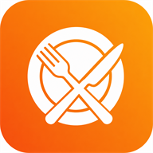

  
  
  
  

  Construyo aplicaciones web de punta a punta: <strong>React / Next.js</strong>, APIs con <strong>Node, FastAPI y Spring Boot</strong>, y productos SaaS que se pueden abrir en el navegador. 
  Código que se puede clonar, probar y desplegar — no demos que se quedan en localhost.

---

## Actualmente construyendo

<table>
  <tr>
    <td width="34%" valign="top">
      

        
      

      <strong><a href="https://github.com/leonardeco/Menu-Flow">MenuFlow</a></strong>
      — <a href="https://menu-flow-navy.vercel.app">demo</a>
      <code>🧪 Beta</code>  
      SaaS multi-restaurante: tienda web, QR de mesa, KDS en vivo, trial 14 días y cobro (Wompi o WhatsApp). Desplegado; todavía sin tracción de mercado.  
      <code>Next.js 15</code> <code>Prisma</code> <code>Neon</code> <code>TypeScript</code>
    </td>
    <td width="33%" valign="top">
      <strong>🏢 <a href="https://github.com/leonardeco/Nexus-CRM">Lanxa ERP / Nexus-CRM</a></strong>
      <code>🚧 En desarrollo</code>  
      ERP + CRM multi-tenant para PYMEs: contabilidad (PUC), cartera, inventario, nómina y pipeline de ventas. JWT en cookie HttpOnly.  
      <code>FastAPI</code> <code>React 19</code> <code>SQLAlchemy</code> <code>PostgreSQL</code>
    </td>
    <td width="33%" valign="top">
      <strong>💰 <a href="https://github.com/leonardeco/GanancIA">GanancIA</a></strong>
      — <a href="https://ganancia.app">ganancia.app</a>
      <code>🧪 Beta</code>  
      Micro-SaaS de rentabilidad para restaurantes: KPIs, matriz de menú, alertas y chatbot. Online; en prueba, sin validación comercial aún.  
      <code>Next.js</code> <code>Fastify</code> <code>PostgreSQL</code> <code>TypeScript</code>
    </td>
  </tr>
</table>

  
    <strong>Beta</strong> = URL pública o deploy real, todavía no probado con clientes de pago.
    <strong>En desarrollo</strong> = se está construyendo, no está listo para un usuario final.
  

---

## Tecnologías

**En beta (las uso en apps ya desplegadas)**

**En desarrollo (las estoy metiendo en productos que aún no salen)**

**Cloud, calidad y día a día**

---

## Proyectos

**🧪 Beta — deploy real, sin prueba de mercado**

### 🍽️ [MenuFlow](https://github.com/leonardeco/Menu-Flow) — [menu-flow-navy.vercel.app](https://menu-flow-navy.vercel.app)
Pedidos web + QR de mesa + cocina en tiempo real. Registro, trial, catálogo, caja y suscripción. 265 tests, OpenAPI, aislamiento por restaurante.
`Next.js 15` `TypeScript` `Prisma` `Neon` `Tailwind` `Vercel`

### 🏢 [Lanxa Technology](https://github.com/leonardeco/Lanxa-Technology) — [lanxa-technology.vercel.app](https://lanxa-technology.vercel.app)
Sitio de la software factory en Armenia: servicios, portafolio y WhatsApp.
`Next.js` `TypeScript` `Tailwind`

### 💰 [GanancIA](https://github.com/leonardeco/GanancIA) — [ganancia.app](https://ganancia.app)
Rentabilidad, matriz de menú y alertas para restaurantes.
`Next.js` `Fastify` `PostgreSQL` `TypeScript`

**🚧 En desarrollo**

### 🏢 [Lanxa ERP](https://github.com/leonardeco/Nexus-CRM) · [Nexus-CRM](https://github.com/leonardeco/Nexus-CRM)
ERP + CRM: PUC, CxC/CxP, inventario, nómina, pipeline. Multi-tenant.
`FastAPI` `React 19` `SQLAlchemy` `JWT`

### 🚀 [SaaS Boilerplate](https://github.com/leonardeco/saas-boilerplate)
Auth, orgs, Stripe, CI. Base para sacar un SaaS más rápido.
`Next.js` `Fastify` `Drizzle` `Stripe` `Turborepo`

### 🍽️ [ReservaYa](https://github.com/leonardeco/ReservaYa) `equipo`
Reservas online: búsqueda, ficha, confirmación y panel.
`Angular` `TypeScript` `Tailwind`

Más (tienda, fitness, APIs Java)

**[LEOFIT](https://github.com/leonardeco/sports-store)** — catálogo y pedido por WhatsApp. `React` `Vite`  
**[BioFit Dashboard](https://github.com/leonardeco/biofit-dashboard)** — bioimpedancia y planes. `Next.js`  
**[OptiAgenda](https://github.com/leonardeco/OptiAgenda)** — citas con JWT. `Java 17` `Spring Boot`  
**[Lotería — backend](https://github.com/leonardeco/loteria-backend)** — API de prueba técnica. `Spring Boot`  
**[CM Aguacates Quindío](https://github.com/leonardeco/cmaguacates)** — landing comercial. `HTML` `CSS` `JS`

---

## Actividad

  
  

  

  

---

  <i>Abierto a oportunidades de trabajo y proyectos freelance</i> 
  <a href="mailto:leonardecojt@gmail.com">leonardecojt@gmail.com</a> · <a href="https://wa.me/573226993891">WhatsApp</a>

